
<h1 align="center">大学生创新创业项目管理系统</h1>

## 简介
大学生创新创业项目管理系统：角色包括管理员、指导教师和学生，主要功能涵盖项目申请、选题审核、进度管理、公告信息及成果展示，支持角色注册和权限管理，利用Spring Boot技术实现高效项目管理。    --计算机毕业设计源码；毕设源码；java毕业设计源码

## 联系方式

<h3 align="center">获取完整代码与数据库文件 + 微信：deepguan QQ: 86050149 QQ群: 783742310</h3>

<h3 align="center">可帮忙远程部署 包运行成功！提供远程部署、修改代码、设计文档指导、代码讲解等服务！</h3>

## 功能介绍（完整见运行截图）
管理员：管理员可以通过系统进行登录和注册，利用系统的导航菜单访问多个管理模块，包括项目申报管理、选题审核管理和项目进度管理等。他们能够管理学生信息、指导教师信息，并对项目申请进行审核，查看并更新项目进度状态。管理员还可以通过提供的操作按钮进行项目详情查看、修改和删除操作，以及发布公告信息以便告知用户。

指导教师：指导教师可以通过系统登录并注册，通过个人中心管理个人信息，并在项目申报管理和项目进度管理模块中查看和指导学生的项目。指导教师可以审核学生提交的项目申请，提供反馈，并协助更新项目的进度状态。系统还允许他们通过专用界面与学生进行交流，促进项目的按计划推进。

学生：学生用户能够通过系统进行注册和登录，提交项目申请，查看与管理自己参与的项目。在登录后的个人中心，学生可以更新个人信息，并跟踪项目的申报状态和进度。他们可以通过系统与指导教师和管理员交流，获取审核意见和建议，此外，系统还为学生提供了即时上传项目文件的功能，并允许查看个人项目的详细信息。

其他用户：此角色包括了系统的访客用户，尽管他们无法进行项目管理操作，但可以通过网站首页了解系统的基本信息和服务范围。通过注册为特定角色（如学生或指导教师）后，他们可以访问更多功能和信息。

## 运行截图
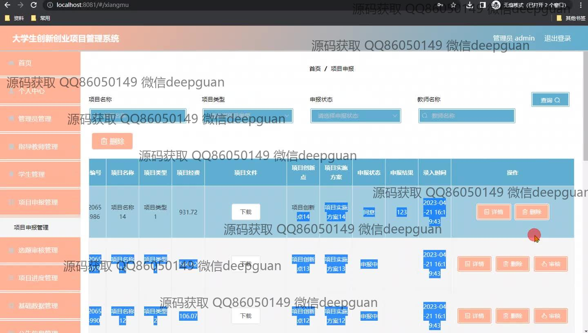
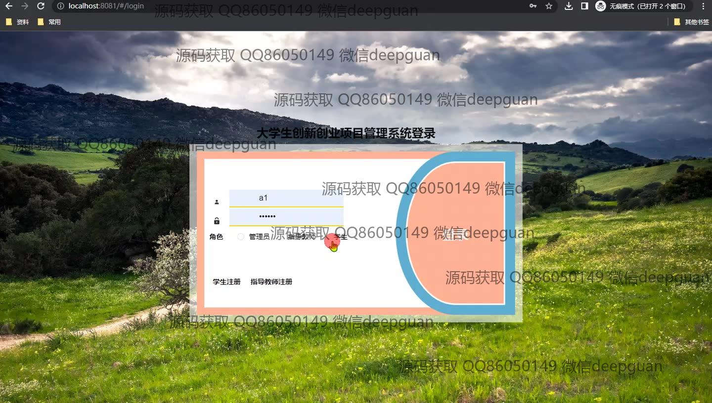
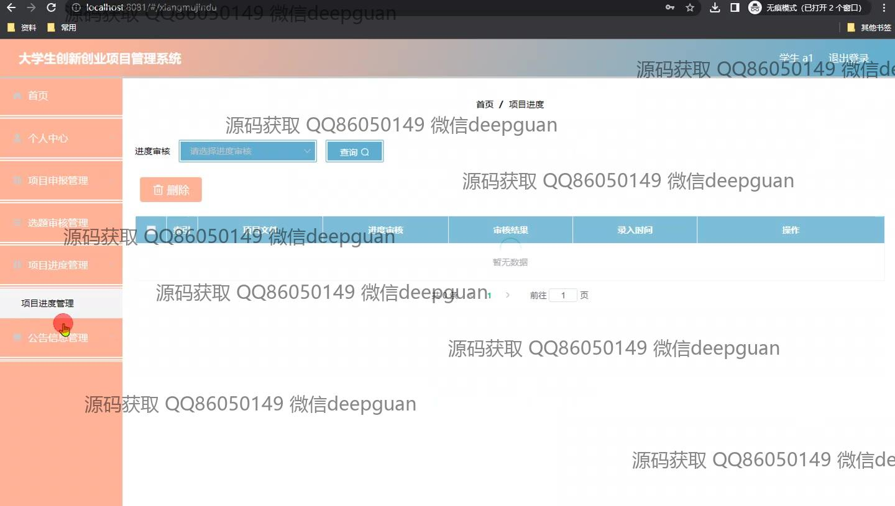
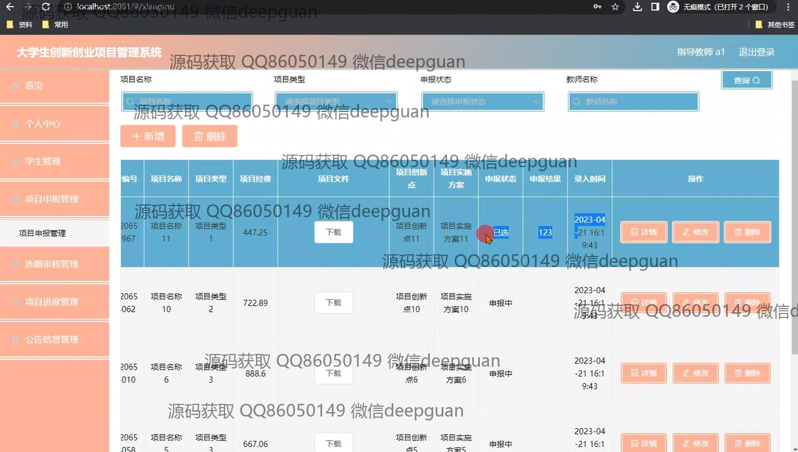
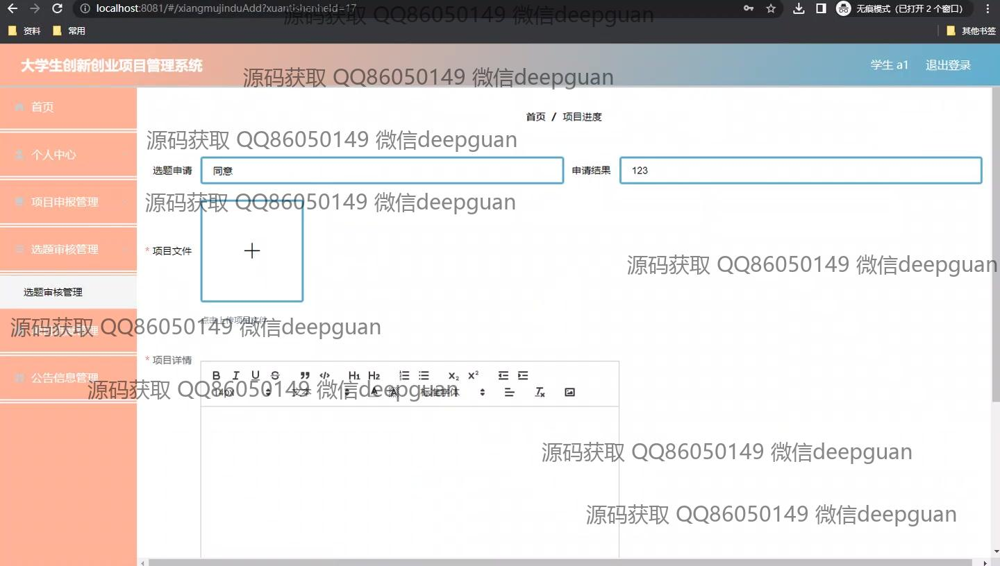
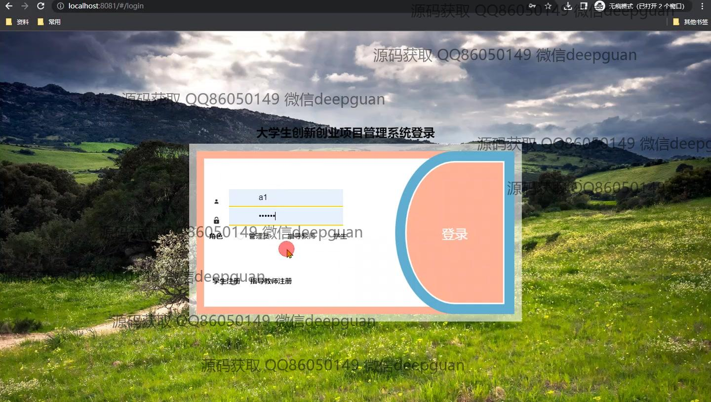
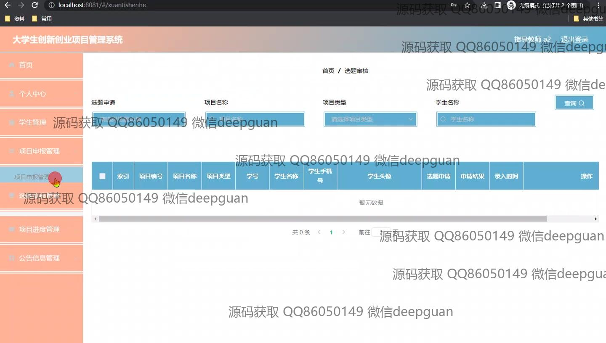
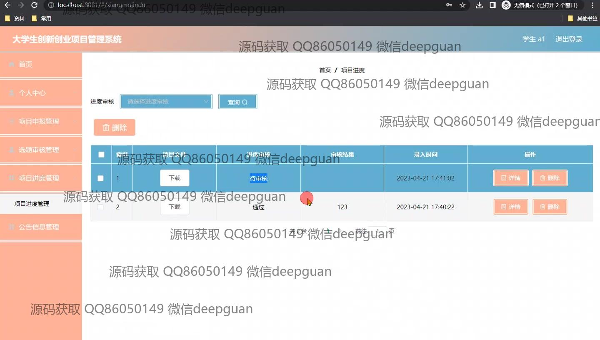
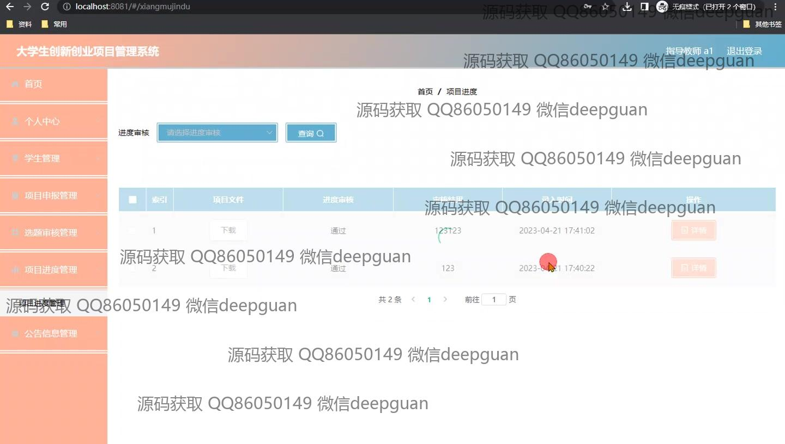

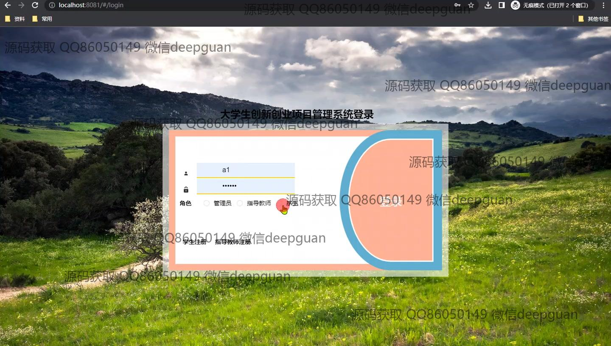
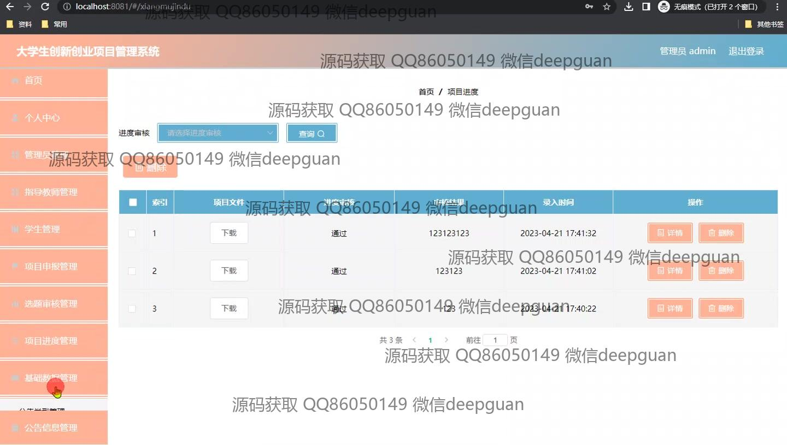

本代码来源于网络,仅供学习参考使用!

